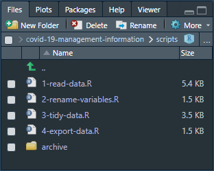

# Understanding the R script

The R script has been designed to be robust. It does its best to cope with the (at times chaotic) data sets.

Most of the tables contained within the data set are very similar. Rather than have a separate script for each table, the master R script does the following:

1. Download the latest versions of the two data sets (whole-of-Scotland and Health Boards).  
   It will download the latest versions automatically, based on your system clock.
2. Load the rules for each table contained within the data set from the following files:  
   `import/data-set-rules.csv`  
   `import/data-set-structure.csv`
3. Using the variables given in the rules tables, run a `for()` loop through the R script, one for each table.  
   The scripts run can be found in the `scripts/` folder.

4. Combine all of the tables (the whole data set) into one large table, for uploading to statistics.gov.scot.
5. Export all of the tables to:  
   `export/`  
   The whole data set is exported to:  
   `export/upload-to-open-data-platform.csv`

The R script has been commented with the aim to explain what each section of the script does.

Because the R script is run as a loop, remember that any change to the R script applies to every table in the data set.

## Observing the data

Each table can be found under the `data_sets` list.

- Metadata is attached to each list to allow you to identify what each table is.  
  Metadata can be found under `data_sets > table_name > metadata`.
- Data can be found under `data_sets > table_name > data`.

## The settings tables

The settings -- which determine the rules for importing each table -- are stored as CSV files. They are found in the `import/` folder. The key tables are:

1. `data-set-rules.csv`, which contains the importing rules and flags for each table.  
   These rules tell R how to interpret each table. This means that the R script can be rather small, and (hopefully) easier to understand. It also means that any change to the R script applies to all tables.
2. `import/data-set-structure.csv`, which contains the names of the variables / columns.  
   For each variable, its original name and new name is provided. The data type is specified to allow the script to perform sanity checking and QA on that variable. You can also define columns to be ignored with `skip`. Skipped columns are still checked for existence, which helps confirm that the table hasn't changed.

You can modify these settings tables to add new tables, or fix problems with the rules for importing the existing tables.
