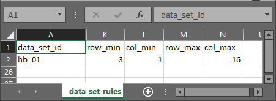
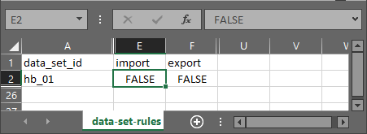

# Troubleshooting

## Changing a table's size, dimensions, or range

The most common error involves a table's dimensions changing. This is usually because the maintainer of the data set has added a comment beside (or even inside) the table. R typically interprets this as more data, and will attempt to expand the table to suit.

Because this could silently induce errors in the table for upload to statistics.gov.scot, columns and dimensions must now be strictly defined. This is intended behaviour, to ensure the integrity of the data.

If the dimensions for each table found in the data set do not match what is defined in `data-set-rules.csv`, the R script will stop with an error.

In the example below, the table `hb_01` starts at row 3, column 1. It has 16 columns. It has no defined maximum rows, so it will fetch the data from all rows.

If a table's dimensions are changed, modify its rules in `data-set-rules.csv` accordingly.

## Changing a table's variable names

The table `import/data-set-structure.csv` contains all of the variables found in each data set.

This is a large table, but it allows the R script to automatically rename variables and confirm that column names and types have not changed.

## Adding new variables

1. Open `import/data-set-rules.csv`.
2. For the chosen table, increase the value of `col_max` accordingly.
3. Save `import/data-set-rules.csv`.
4. Open `import/data-set-structure.csv`.
5. Add new rows containing the column names (see example below).
6. Save `import/data-set-structure.csv`.
7. Run (source) the R script.

| data_set_id | col_id | col_name_old                 | col_name_new                 | col_type |
|-------------|--------|------------------------------|------------------------------|----------|
| example     | 11     | Old column name (from Excel) | New column name (for output) | numeric  |

If the number of columns defined in `import/data-set-structure.csv` does not match the number of columns found, or the names of the columns do not match, R will produce an error. This is intended behaviour, to ensure the integrity of the data.

## Disabling a table entirely

If you can not fix a table, you can change its entry in `data-set-rules.csv`.

1. Open `data-set-rules.csv`.
2. Scroll to the table to be disabled.
3. Change the variables `import` and `export` for that data set to `FALSE`.
4. Save your changes.
5. Run (source) the R script again.

